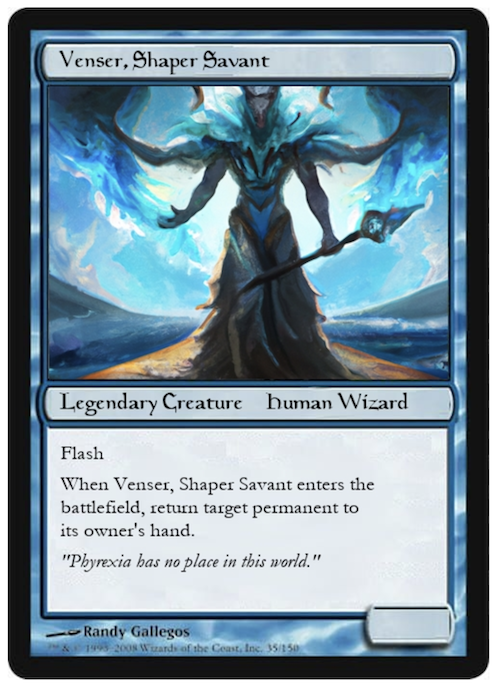
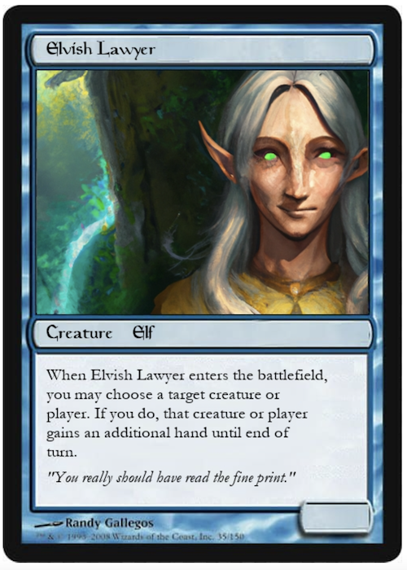

# Magic the GPThering
Playground for generating cards in the style of "Magic The Gathering" using generative AI models.

## Overview

Magic the GPThering is a small Python application that generates "realistic" magic cards in the style of ["Magic The Gathering"](https://magic.wizards.com/en), the popular card game we (all?) played when we were young.

The app is built as a Streamlit app, wrapping with Python the generative capabilities of OpenAI models, [GPT](https://arxiv.org/abs/2005.14165) and [DALLE](https://arxiv.org/abs/2102.12092). The GPT prompts are built from more or less random cards (leveraging the great database [here](https://scryfall.com/?utm_source=mci)).

If you care about the cards, just go to the [online app](https://jacopotagliabue-magic-the-gpthering-streamlit-magic-app-b5c8m0.streamlit.app/). If you want to improve it (God knows how much that's needed!), feel free to play around with the code: it's all pretty hacky, but the code should be simple and self-contained enough that making it better should be straightforward. This was a fun week-end project and should be treated with the appropriate sense of humour.

Generated cards may be similar to this one:



Note that in this case the model actually picked *an existing card name* (you can check [online](https://scryfall.com/card/2x2/66/venser-shaper-savant)), and then  partially "hallucinate" the rest. In general, as usual with these models, it is hard to make sure content is truly new.

## Generate cards

IMPORTANT: since we leverage OpenAI APIs, you need to have your own API key to generate cards. You can quickly sign up [here](https://openai.com/api/) to get one, if you don't have one already. The streamlit app doesn't store your credentials anywhere.

If you don't specify a name prompt, the model will generate that based on color and type. If you do specify a card name, the model will instead use that in the prompt. NOTE: this allows you to prompt generative models for pretty unexpected creatures, like for example this "Sea Lawyer":



What weird magical entity can you come up with?

### Cloud app

Browse to our Streamlit app [here](https://jacopotagliabue-magic-the-gpthering-streamlit-magic-app-b5c8m0.streamlit.app/) - you should be able to generate cards directly on your browser (if the app is "sleeping" on the Streamlit servers, follow the browser instructions to spin it up again).

### Running the code locally

The code was developed using Python 3.9. To run the app locally, clone the repo, setup a virtual environment and run the app from there:

```
python -m venv venv
source venv/bin/activate
pip install -r requirements.txt
streamlit run streamlit_magic_app.py
```

A new browser window should open up, displaying the card generating app.

## What's next?

Of course, everything feels a bit hacky, as it should be for a fun week-end project! There are milion ways you could try and improve all of this, for example:

* improving the card generation process with some more details on the card (for example, font / better rendering of small elements, check for text size etc.), as well as supporting multiple card templates (green, white, lands etc.);
* better prompting for GPT3;
* using other generative AI systems for the image (Midjourney has a fantasy touch, but no API still!);
* generate multiple images for the same card and let the user pick one;
* use image models better to produce a card drawing with the proper aspect ratio, instead of just cropping the image like now.

Feel free to star this repo, fork the code and build your own generator!

## License

All the code is released without warranty, "as is" under a MIT License. We are not affiliated with, endorsed, sponsored, enchanted, truth or dare, by Wizards of the Coast LLC, OpenAI etc. This was a fun week-end project and should be treated with the appropriate sense of humour.

We are indeed very grateful to Wizards of the Coast for the endless amount of fun we had as kids: "When we was young, oh man, did we have fun / Always, always".